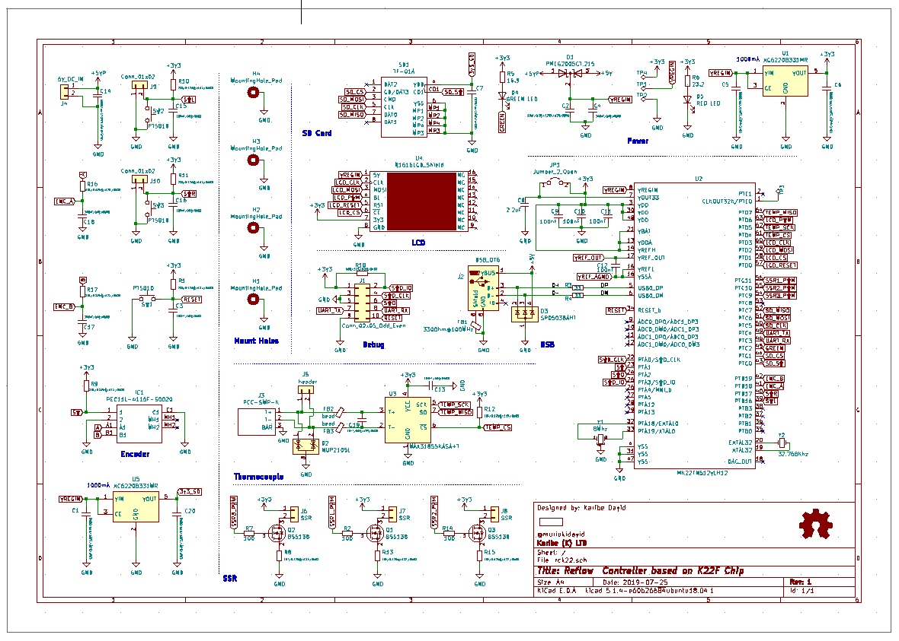
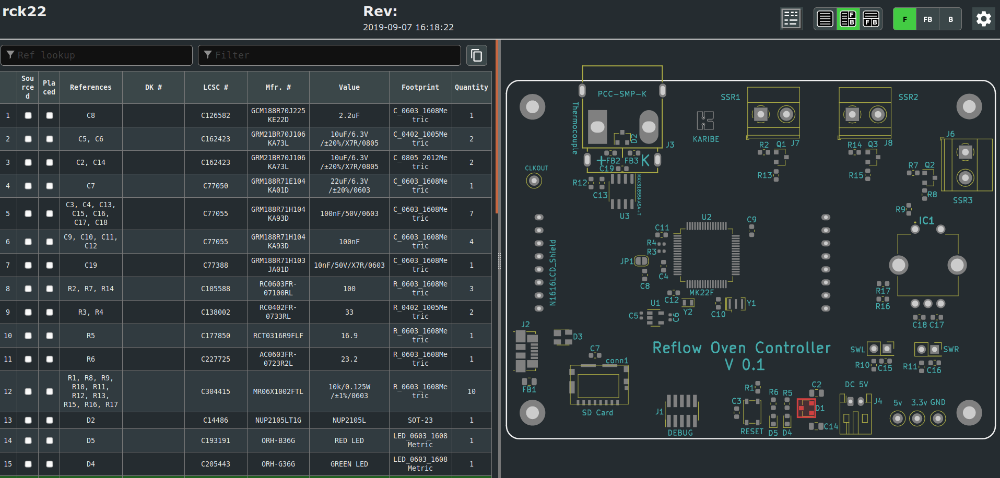

 
This is a reflow oven controller based on tinyK22 board with NXP K22P121M120SF7RM MCU.

The goal is to use the board on a breadboard for developing the firmware and design a custom board 

### Prototype Schematic

### Bread Board Prototype

### Custom Board Schematic
<!-- -->

### Custom Board Top View 

A preview of the ongoing Custom board PCB design

A 3D preview of the current design

### BOM
<a href="https://htmlpreview.github.io/?https://github.com/Muriukidavid/reflow_toaster_oven/blob/master/kicad_board_files/custom_board/bom/ibom.html" rel="BOM">
