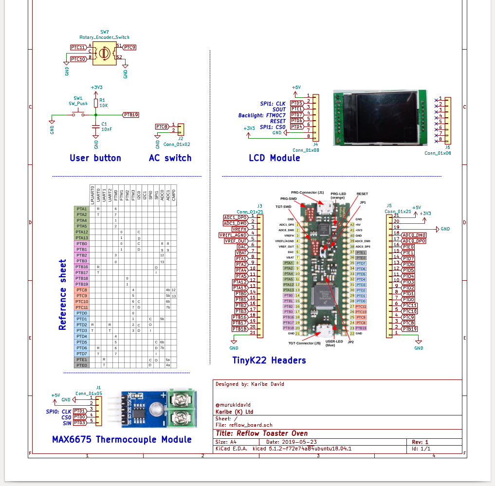
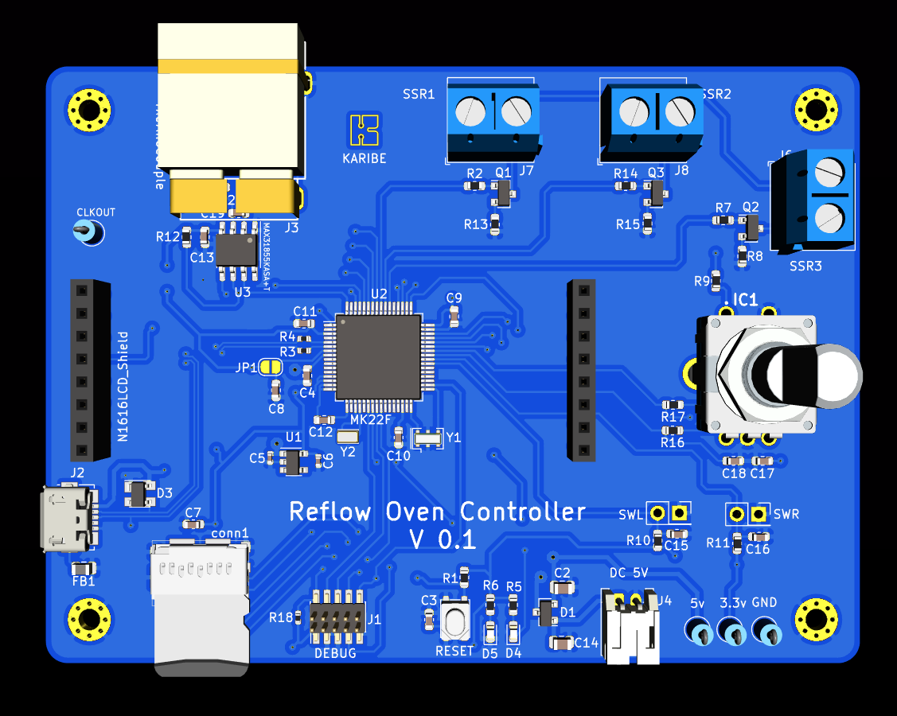

 
This is a reflow oven controller based on tinyK22 board with NXP K22P121M120SF7RM MCU.

The goal is to use the board on a breadboard for developing the firmware and design a custom board 

### Prototype Schematic

### Bread Board Prototype

### Custom Board Schematic
<!-- -->

### Custom Board Top View 

A preview of the ongoing Custom board PCB design

A 3D preview of the current design

